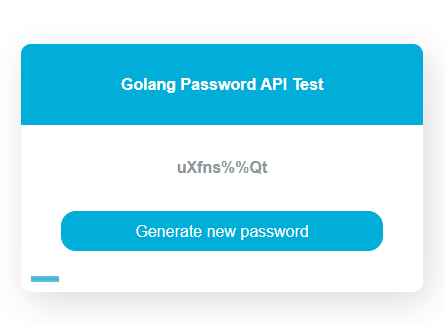

# webPasswordGen

webPasswordGen est une application écrite en GO permettant de générer des mots de passe de 8 caractères.

Cette application met à sa disposition une API REST permettant de récupérer les mots de passes générée par la méthode GET


## Demonstration



## API Reference

#### Générer un mot de passe

```http
  GET /api/generate
```

## Run Locally

Clone the project

```bash
  git clone https://github.com/kevinfosse/webPasswordGen
```

Go to the project directory

```bash
  cd webPasswordGen
```

Build the source

```bash
  go build .
```

Start the server


## Roadmap

- Ajouter des paramètres à la génération de mot de passe

- Bloquer la progressbar lorsque l'utilisateur selectionne le mot de passe

- Copier le mot de passe lors du clique


## Auteur

- [@kevinfosse](https://www.github.com/kevinfosse)

